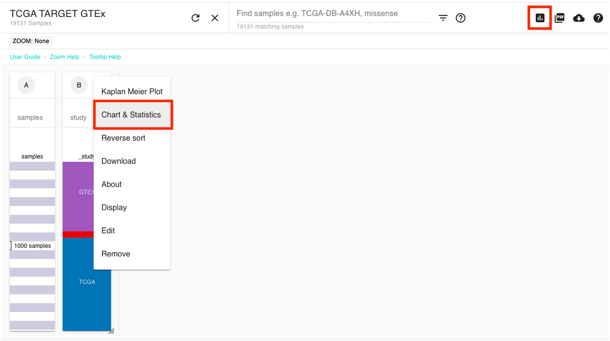
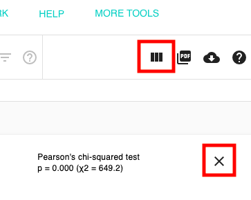

# Chart & Statistics View

Chart View will generate bar plots, box plots, violin plots, scatter plots, and distribution graphs using any of the columns in a Visual Spreadsheet. Statistics, such as [Welch's t-test,](https://en.wikipedia.org/wiki/Welch's_t-test) [Pearson's](https://en.wikipedia.org/wiki/Pearson_correlation_coefficient) and [Spearman's rank correlation](https://en.wikipedia.org/wiki/Spearman's_rank_correlation_coefficient), and [ANOVA](https://en.wikipedia.org/wiki/Analysis_of_variance) will be calculated automatically.

## Enter Chart View

To get to the chart view click on the icon indicated below by the red box or use the column menu and select 'Chart & Statistics'.

## Build a chart

Once you enter Chart View, it will ask you a series of questions about what type of graph you are trying to make.

**Compare subgroups** will allow you to compare groups of samples, either those that you have made or via a categorical feature, such as sample type. It will build the appropriate graph depending on whether you have selected a continuous numerical or categorical column. This option will let you make box plots, violin plots, and bar charts.

**See a distribution** will let you see the distribution of the data in a single column.

**Make a scatterplot** will make a scatterplot from two continuous numerical columns.

If an option is grayed out, this means that you do not have enough or the right type of data on the screen. Return to the Visual Spreadsheet and add more data.

## After building a chart

We show statistics in the upper right corner of the screen for most graphs. If we detect it will take some time run the statistics we may instead show a button with 'run stats', so that you can decide if you would like to run the statistical test.

Advanced options available under the graph will allow you to change the scales of the axes. If you are viewing a scatterplot it will also allow you to color the points by a column of data.


Note that for violin plots, the width of each plot is does not relate to the number of samples in the plot.


## Return to the Visual Spreadsheet

To return to the Visual Spreadsheet, click either the icon in the upper left, or the 'x' close button.

## Example Analyses

**Scatter plot of arm-level deletions in gliomas**

[Live bookmark of above image](https://xenabrowser.net/heatmap/?bookmark=be9ace892275fa81257e7e03f2533b99)

Above you can see a scatter plot of Glioblastoma Multiforme \(GBM\) and Lower Grade Glioma \(LGG\) samples in TCGA. The x-axis shows copy number variation in chromosome 19q and the y-axis shows copy number variation in chromosome 1p. Samples are colored by primary disease. We can see here that there are a subset of samples in LGG that have a strong correlation between a deletion of chr19q and chr1p. GBM samples do not show this relationship.

**Box plot of EGFR copy number in gliomas**

[Live bookmark of above image](https://xenabrowser.net/heatmap/?bookmark=3b4dd2fb39fab70324c5cda834abcbba)

Above you can see a box plot of EGFR copy number variation in Glioblastoma Multiforme \(GBM\) and Lower Grade Glioma \(LGG\) samples in TCGA. We can see that GBM samples tend to have amplification of EGFR and that this trend is significant \(Welch's t-test, p&lt;0.05\).

