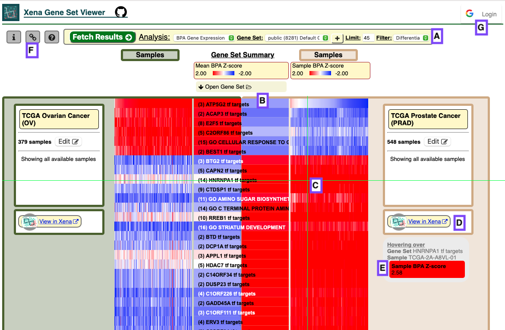

# Xena Gene Set Viewer

The Xena Gene Sets Viewer [https://xenageneset.berkeleybop.io/xena/](https://xenageneset.berkeleybop.io/xena/) compares gene expression, somatic mutation, and copy number variation profile of cancer related gene sets across cancer cohorts.  It queries genomics data hosted on public Xena Hubs, in a similar way as other tools in the Xena Visualization suite. And then it generates gene set visualizations of those data.

Source code:

* [Xena Gene Set Viewer](https://github.com/ucscXena/XenaGoWidget)
* [Xena Analysis Server](https://github.com/ucscXena/xena-analysis-grails)

## Overview

The Gene Set Viewer allows comparison of individual gene sets or pathways and their genes across two cancer tumor sample cohorts as well as comparison within the same sub cohorts.

As an overview, Figure 1 shows two cohorts, the left \(olive background, TCGA Ovarian Cancer\)  and the right \(tan background , TCGA Prostate Cancer\).    Figure 1A shows the selection for the analysis, Gene Set, view limit, and filter \(differential versus similar\).  Figure 1B shows the view comparing the Mean Gene Set Score in the center and individual samples on the right.   1C shows the individual samples, with the hover result showing the sample and score in 1E.  1D provides a link directly into Xena for the given gene set.  1F provides a sharable URL link.   1G provides a login for use in uploading.

Figure 8 shows analysis of a GMT file using the BPA method \[[citation](https://www.nature.com/articles/s41467-019-12924-w): thanks to Verena Friedl\].   This is only available to logged in users and they may only see their own analysis and are limited to 100 pathways.  Logins are any valid google login.    Several public pathway sets are available including those curated from the Gene Ontology Consortium \(thanks to Laurent-Philippe Albou\) as well as those from the Hallmark \[cite\] and Pancan \[cite\] analyses.

## Analysis

### Gene Expression

* BPA GENE EXPRESSION
* PARADIGM IPL
* REGULON ACTIVITY \(only avaiable for the LUAD Cohort\)

### Mutation / CNV

* CNV ∩ MUTATION
* COPY NUMBER
* MUTATION

## Sources for the somatic mutation and copy number variation data

* [https://xenabrowser.net/datapages/?hub=https://tcga.xenahubs.net:443](https://xenabrowser.net/datapages/?hub=https://tcga.xenahubs.net:443)
* [https://xenabrowser.net/datapages/?cohort=Cancer Cell Line Encyclopedia \(Breast](https://xenabrowser.net/datapages/?cohort=Cancer%20Cell%20Line%20Encyclopedia%20%28Breast)\)

